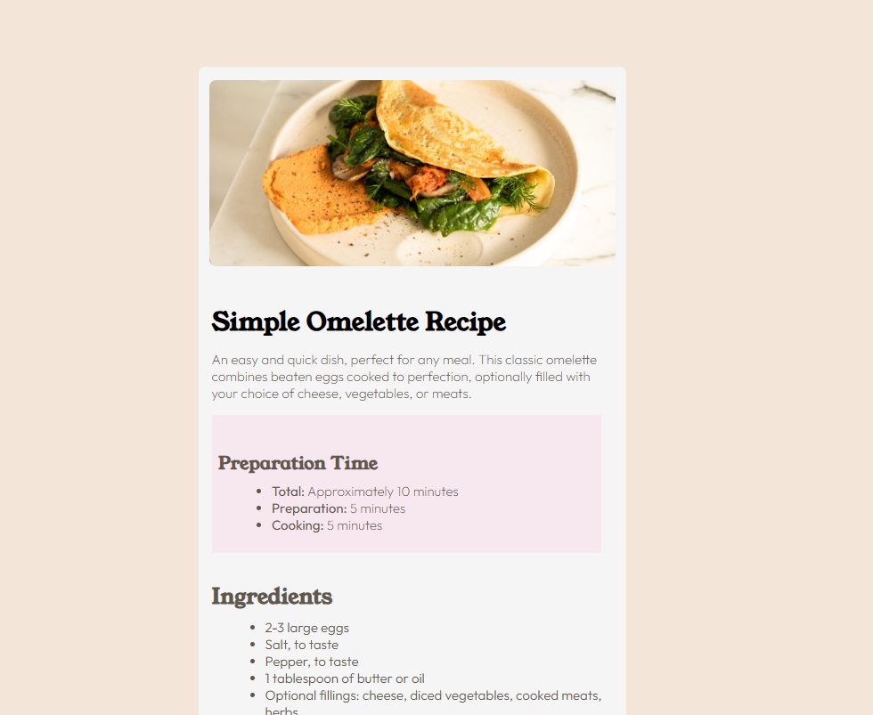
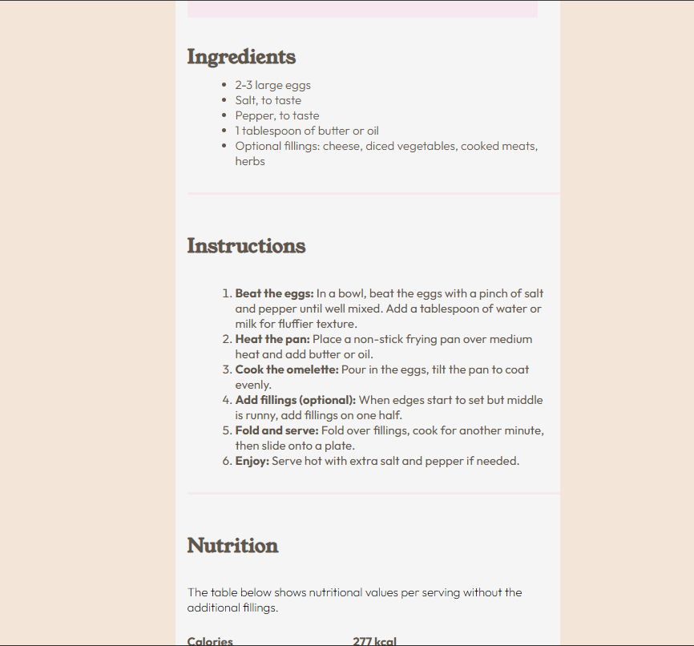
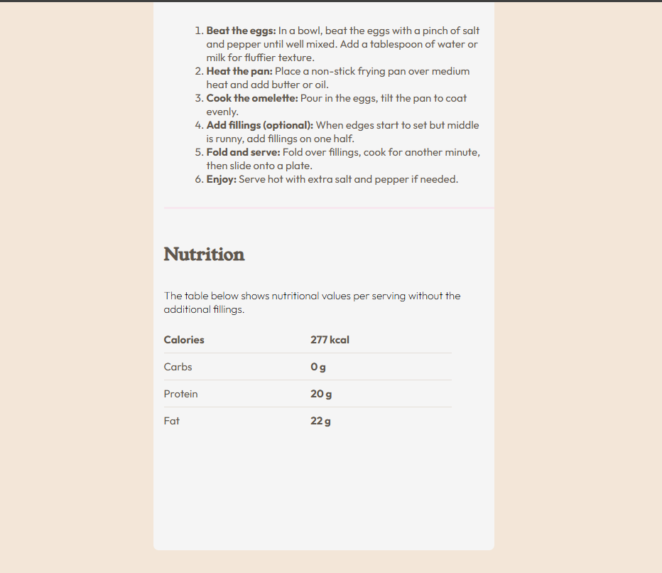
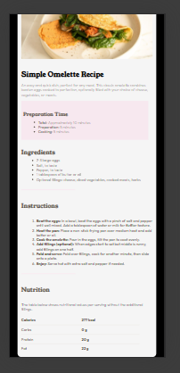

# Frontend Mentor - Recipe page solution

This is a solution to the [Recipe page challenge on Frontend Mentor](https://www.frontendmentor.io/challenges/recipe-page-KiTsR8QQKm). Frontend Mentor challenges help you improve your coding skills by building realistic projects. 

## Table of contents

- [Overview](#overview)
  - [The challenge](#the-challenge)
  - [Screenshot](#screenshot)
  - [Links](#links)
- [My process](#my-process)
  - [Built with](#built-with)
  - [What I learned](#what-i-learned)
  - [Continued development](#continued-development)
  - [Useful resources](#useful-resources)
- [Author](#author)
- [Acknowledgments](#acknowledgments)

**Note: Delete this note and update the table of contents based on what sections you keep.**

🥚 Simple Omelette Recipe

A clean and responsive recipe card built using HTML and CSS — designed to show preparation time, ingredients, cooking instructions, and nutrition facts in a neat, modern layout.

📑 Table of Contents

📋 Overview

🎯 The Challenge

🖼️ Screenshot

🔗 Links

🧠 My Process

🛠️ Built With

💡 What I Learned

🚀 Continued Development

📚 Useful Resources

👨‍💻 Author

🙏 Acknowledgments

📋 Overview
🎯 The Challenge

The goal was to build a responsive recipe card that visually represents an Omelette Recipe using only HTML and CSS.
It should include:

A hero image of the omelette

Sections for preparation time, ingredients, instructions, and nutrition

Clean typography and color balance

Responsive behavior where only the container is visible on small screens

🖼️ Screenshot

💻 Desktop View:

📱 Mobile View:

🔗 Links

🌐 Live Site: Add Your Live URL Here

💾 GitHub Repository: (https://github.com/Khaisar-tech/Recipe-Card)

🧠 My Process
🛠️ Built With

HTML5 semantic markup

CSS3 custom properties & variables

Flexbox for alignment and layout

Media Queries for responsive design

Google Fonts: Young Serif & Outfit

💡 What I Learned

This project helped me:

Write semantic and accessible HTML

Master flexbox for centering and spacing

Use font pairing to create visual contrast

Apply overflow control to create a clipped background on mobile

Keep my CSS organized and scalable

Here’s a small snippet I’m proud of 👇

@media screen and (max-width: 768px) {
  body {
    overflow: hidden;
    height: 100vh;
  }

  .main {
    justify-content: center;
    align-items: center;
    width: 100vw;
  }

  .container {
    width: 90%;
    border-radius: 5px;
  }
}

🚀 Continued Development

In upcoming projects, I plan to:

Add JavaScript interactivity (like dynamic recipes or ingredient filtering)

Experiment with CSS Grid layouts

Explore dark mode and light mode toggles

Improve accessibility with ARIA roles and semantic tags

📚 Useful Resources

🧩 MDN Web Docs – Flexbox Guide
 – Perfect for learning layout behavior.

🎨 Google Fonts
 – For beautiful font combinations.

💻 Frontend Mentor
 – For providing structured challenges and mockups.

📘 CSS Tricks
 – For tips on responsive layouts and best practices.

👨‍💻 Author

Name: Mohammed Khaisar

GitHub: @Khaisar-tech

Frontend Mentor: @Khaisar-tech

LinkedIn: Mohammed Khaisar Hussain

🙏 Acknowledgments

Special thanks to Frontend Mentor for inspiring this project, and to the MDN and CSS Tricks communities for consistently being the best source of clarity and learning.

✨ “Code like a chef — perfect your recipe one ingredient at a time.” ✨
